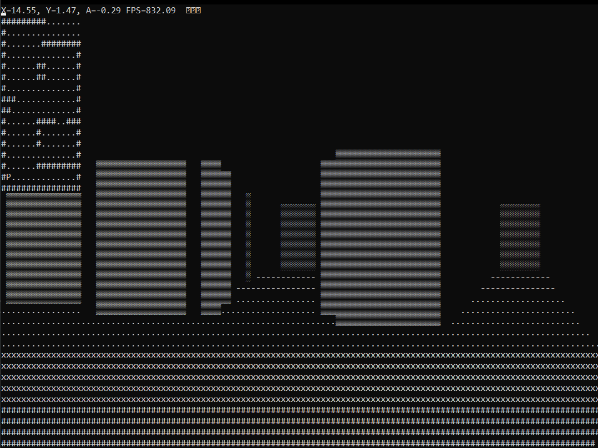

# 3D Console Raycaster in C++

## Overview
This program implements a 3D raycasting engine in a Windows console application, rendering a pseudo-3D environment using ASCII characters. Inspired by classic games like *Wolfenstein 3D*, it simulates a first-person view where the player can navigate a 2D map and view its 3D projection on the screen.

## Features
- **Raycasting Engine:** Simulates 3D walls, floors, and ceilings in real-time.
- **Collision Detection:** Prevents the player from moving through walls.
- **Dynamic Lighting/Shading:** Walls are shaded based on their distance from the player, creating a sense of depth.
- **Player Controls:** Use `W`, `A`, `S`, and `D` for movement and rotation.
- **ASCII Rendering:** The environment is drawn using ASCII shading characters in a Windows console.

## How It Works
1. **Map Representation:**
   - The environment is a 16x16 2D grid where `#` represents walls and `.` represents empty space.
   - The player's position and angle (`fPlayerX`, `fPlayerY`, `fPlayerA`) are tracked in real-time.

2. **Raycasting Logic:**
   - For every column of the console screen, a ray is cast from the player's position at an angle corresponding to the column.
   - The ray checks for collisions with walls (`#`) in the map. The distance to the wall determines the height of the wall slice rendered.

3. **Rendering:**
   - Walls are shaded using Unicode block characters (`█`, `▓`, `▒`, `░`) based on their distance.
   - The floor is shaded with lighter characters (`#`, `x`, `.`, `-`) for visual realism.
   - The player is represented as `P` on the 2D minimap.

## Controls
- `W`: Move forward
- `S`: Move backward
- `A`: Rotate counter-clockwise
- `D`: Rotate clockwise
